# Wireframes del MVP

> Documento de referencia visual para el arranque del Sprint 2 y sprints posteriores.
> Todos los wireframes están diseñados a escala móvil estándar **360 × 800 dp**, utilizando
> exclusivamente los componentes de `DISENO.md` (construidos en S1-T10/S1-T11) y la
> paleta de colores **Taller** (S1-T08/S1-T09).

---

## Resumen de pantallas dibujadas

| ID | Pantalla | Archivo | Variante | Componentes principales |
|---|---|---|---|---|
| **P-01** | Splash | [`P-01-splash.png`](wireframes/P-01-splash.png) | Normal | `Cargando` |
| **P-02** | Iniciar sesión | [`P-02-iniciar-sesion.png`](wireframes/P-02-iniciar-sesion.png) | Normal | `BarraSuperior`, `CampoTexto`, `CampoContrasena`, `BotonPrincipal`, `BotonTexto` |
| **P-03** | Registro | [`P-03-registro.png`](wireframes/P-03-registro.png) | Normal | `BarraSuperior`, `ChipCategoria`, `CampoTexto`, `CampoContrasena`, `BotonPrincipal`, `BotonTexto` |
| **P-04** | Recuperar contraseña | [`P-04-recuperar.png`](wireframes/P-04-recuperar.png) | Normal | `BarraSuperior`, `CampoTexto`, `BotonPrincipal`, `BotonTexto` |
| **P-05** | Inicio cliente | [`P-05-inicio-cliente.png`](wireframes/P-05-inicio-cliente.png) | Contenido | `BarraSuperior`, `CampoTexto`, `ChipCategoria`, `TarjetaTrabajador`, `Estrellas`, `BotonDestacado`, `BarraInferior` |
| **P-05** | Inicio cliente | [`P-05-vacio.png`](wireframes/P-05-vacio.png) | Vacío | `BarraSuperior`, `CampoTexto`, `ChipCategoria`, `EstadoVacio`, `BotonPrincipal`, `BotonDestacado`, `BarraInferior` |
| **P-05** | Inicio cliente | [`P-05-error.png`](wireframes/P-05-error.png) | Error | `BarraSuperior`, `EstadoError`, `BotonPrincipal`, `BarraInferior` |
| **P-10** | Inicio trabajador | [`P-10-inicio-trabajador.png`](wireframes/P-10-inicio-trabajador.png) | Contenido | `BarraSuperior`, `ChipCategoria`, `TarjetaSolicitud`, `EtiquetaEstado`, `BarraInferior` |
| **P-10** | Inicio trabajador | [`P-10-vacio.png`](wireframes/P-10-vacio.png) | Vacío | `BarraSuperior`, `ChipCategoria`, `EstadoVacio`, `BotonPrincipal`, `BarraInferior` |
| **P-10** | Inicio trabajador | [`P-10-error.png`](wireframes/P-10-error.png) | Error | `BarraSuperior`, `EstadoError`, `BotonPrincipal`, `BarraInferior` |
| **P-18** | Mi cuenta | [`P-18-cuenta.png`](wireframes/P-18-cuenta.png) | Normal | `BarraSuperior`, `EtiquetaEstado`, `BotonSecundario`, `BarraInferior` |

---

## 1. P-01 · Pantalla de bienvenida (Splash)

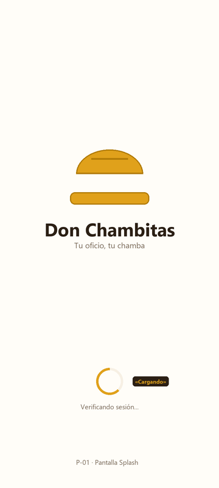

### Objetivo y descripción
Primera pantalla que se presenta al usuario al abrir la aplicación. Muestra el isotipo del casco y la identidad Don Chambitas sobre fondo `Crema`, mientras el ViewModel consulta el estado de la sesión guardada y decide el destino de navegación:
- **Sin sesión:** navega a `P-02` (Iniciar sesión).
- **Con sesión de Cliente:** navega a `P-05` (Inicio cliente).
- **Con sesión de Trabajador:** navega a `P-10` (Inicio trabajador).

Permanece visible un mínimo de 800 ms para evitar parpadeos y se retira de la pila hacia atrás (`popUpTo(0)`), de modo que presionar regresar desde el inicio o login cierra la aplicación.

### Zonas y componentes exactos
- **Fondo:** `Crema` (`#FFFDF8`).
- **Logo central:** Casco de seguridad en color `Mostaza` (`#E0A11B`) con visera y franja en `MostazaOscuro` (`#B37D08`), texto "Don Chambitas" en `Carbon` (`#2B1F14`) y lema "Tu oficio, tu chamba" en `Cafe` (`#7A6A58`).
- **Indicador de proceso inferior:** `Cargando` circular en color `Mostaza` (48 dp de diámetro) con etiqueta de apoyo "Verificando sesión...".

### Elementos tocables y comportamiento
- Esta pantalla no contiene elementos interactivos tocables; su transición es automática tan pronto concluye la verificación de sesión y el temporizador mínimo de 800 ms.

---

## 2. P-02 · Iniciar sesión

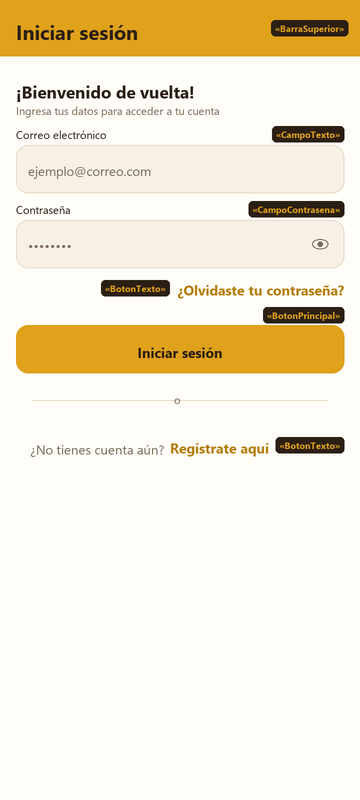

### Objetivo y descripción
Permite a usuarios registrados ingresar con sus credenciales de correo electrónico y contraseña. Proporciona enlaces claros para recuperar contraseña en caso de olvido y para crear una nueva cuenta si no se tiene registro.

### Zonas y componentes exactos
- **Encabezado:** `BarraSuperior` en color `Mostaza` con título "Iniciar sesión" en `Carbon`.
- **Formulario de captura:**
  - `CampoTexto`: Etiqueta "Correo electrónico", fondo `Arena`, borde `Borde`, texto secundario `Cafe`.
  - `CampoContrasena`: Etiqueta "Contraseña", fondo `Arena`, borde `Borde`, con icono de alternancia de visibilidad.
- **Acción secundaria:** `BotonTexto` alineado a la derecha para "¿Olvidaste tu contraseña?".
- **Acción principal:** `BotonPrincipal` con fondo `Mostaza`, texto `Carbon` en ancho completo y 48 dp de altura ("Iniciar sesión").
- **Pie de pantalla:** `BotonTexto` para "¿No tienes cuenta aún? Regístrate aquí" en `MostazaOscuro`.

### Elementos tocables y comportamiento
| Elemento | Componente | Comportamiento al tocar |
|---|---|---|
| Campo de correo | `CampoTexto` | Abre el teclado en modo email, enfoca el campo cambiando el borde a `MostazaOscuro`. |
| Campo de contraseña | `CampoContrasena` | Abre el teclado numérico/alfanumérico, enfoca el campo. |
| Alternador de contraseña | Icono ojo en `CampoContrasena` | Cambia entre texto oculto (`••••••••`) y visible en texto plano. |
| "¿Olvidaste tu contraseña?" | `BotonTexto` | Navega a `P-04` (Recuperar contraseña), apilando la pantalla para permitir regreso. |
| "Iniciar sesión" | `BotonPrincipal` | Valida formato de correo y contraseña no vacía. Si es válido, muestra spinner dentro del botón y ejecuta autenticación. Al éxito, limpia la pila y navega a `P-05` (si es cliente) o `P-10` (si es trabajador). Si falla, muestra `CampoTexto` con borde en `Error` y mensaje descriptivo. |
| "Regístrate aquí" | `BotonTexto` | Navega a `P-03` (Registro). |

---

## 3. P-03 · Registro con selección de rol

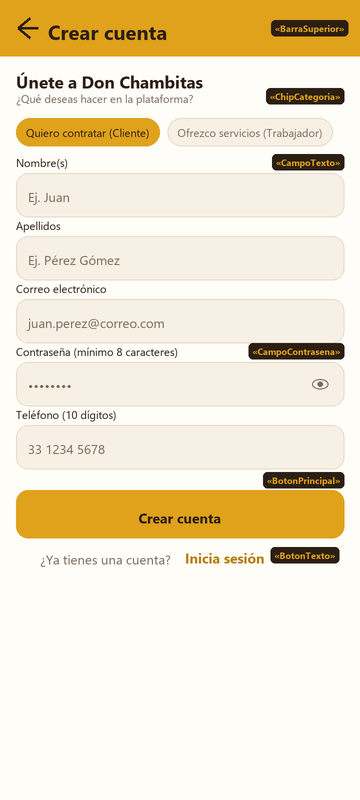

### Objetivo y descripción
Permite la creación de nuevas cuentas para clientes o trabajadores, capturando los datos personales mínimos obligatorios y seleccionando el rol único del usuario (DEC-22: el rol seleccionado es permanente y no se puede cambiar).

### Zonas y componentes exactos
- **Encabezado:** `BarraSuperior` en color `Mostaza` con flecha de regreso y título "Crear cuenta".
- **Selector de rol:**
  - Fila con dos `ChipCategoria`: "Quiero contratar (Cliente)" y "Ofrezco servicios (Trabajador)". El chip seleccionado toma fondo `Mostaza` y texto `Carbon`; el inactivo toma fondo `Arena`, borde `Borde` y texto `Cafe`.
- **Campos de captura:**
  - `CampoTexto`: Nombre(s).
  - `CampoTexto`: Apellidos.
  - `CampoTexto`: Correo electrónico.
  - `CampoContrasena`: Contraseña (mínimo 8 caracteres) con icono de visibilidad.
  - `CampoTexto`: Teléfono celular (10 dígitos).
- **Acción principal:** `BotonPrincipal` "Crear cuenta" (fondo `Mostaza`, texto `Carbon`).
- **Pie de pantalla:** `BotonTexto` "¿Ya tienes una cuenta? Inicia sesión".

### Elementos tocables y comportamiento
| Elemento | Componente | Comportamiento al tocar |
|---|---|---|
| Flecha de regreso | `BarraSuperior` | Descarta el formulario y regresa a `P-02`. |
| Chip Cliente | `ChipCategoria` | Selecciona el rol `cliente`. Se pinta en `Mostaza`; deselecciona Trabajador. |
| Chip Trabajador | `ChipCategoria` | Selecciona el rol `trabajador`. Se pinta en `Mostaza`; deselecciona Cliente. |
| Campos de texto (5) | `CampoTexto` / `CampoContrasena` | Enfocan el control correspondiente, abren teclado adecuado (texto, email, numérico telefónico). |
| Alternador de visibilidad | Icono ojo en `CampoContrasena` | Muestra u oculta los caracteres de la contraseña ingresada. |
| "Crear cuenta" | `BotonPrincipal` | Ejecuta validación completa de campos. Si pasan, muestra estado de carga y registra al usuario en backend. Al completar, navega a la pantalla inicial del rol elegido (`P-05` para cliente, `P-10` para trabajador). Si hay errores de validación, resalta los campos afectados con `Error`. |
| "Inicia sesión" | `BotonTexto` | Navega de vuelta a `P-02` (Iniciar sesión). |

---

## 4. P-04 · Recuperar contraseña

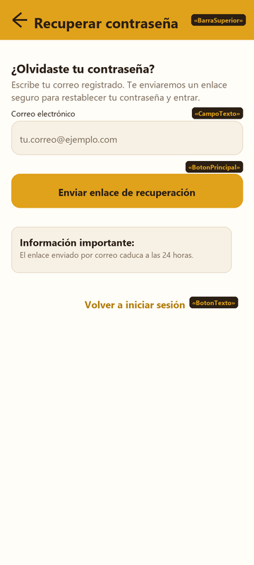

### Objetivo y descripción
Permite a los usuarios solicitar un enlace por correo electrónico para restablecer su contraseña olvidada. Explica con claridad la vigencia temporal del enlace.

### Zonas y componentes exactos
- **Encabezado:** `BarraSuperior` en color `Mostaza` con flecha de regreso y título "Recuperar contraseña".
- **Cuerpo explicativo:** Textos de lectura en estilo `subtitulo` (`Carbon`) y `cuerpo` (`Cafe`).
- **Captura:** `CampoTexto` para ingresar el correo electrónico registrado.
- **Acción de envío:** `BotonPrincipal` "Enviar enlace de recuperación" (48 dp).
- **Tarjeta de aviso:** Contenedor en superficie `Arena` con borde `Borde` recordando la vigencia de 24 horas del enlace.
- **Pie:** `BotonTexto` para "Volver a iniciar sesión".

### Elementos tocables y comportamiento
| Elemento | Componente | Comportamiento al tocar |
|---|---|---|
| Flecha de regreso | `BarraSuperior` | Regresa a `P-02` (Iniciar sesión). |
| Campo de correo | `CampoTexto` | Enfoca el campo, despliega teclado de email. |
| "Enviar enlace de recuperación" | `BotonPrincipal` | Valida que el correo tenga estructura válida. Dispara la llamada de recuperación; al éxito, muestra confirmación en pantalla y deshabilita el botón con mensaje de correo enviado. |
| "Volver a iniciar sesión" | `BotonTexto` | Regresa de inmediato a `P-02`. |

---

## 5. P-05 · Inicio cliente (3 estados)

### 5.1 Estado con datos (Contenido)
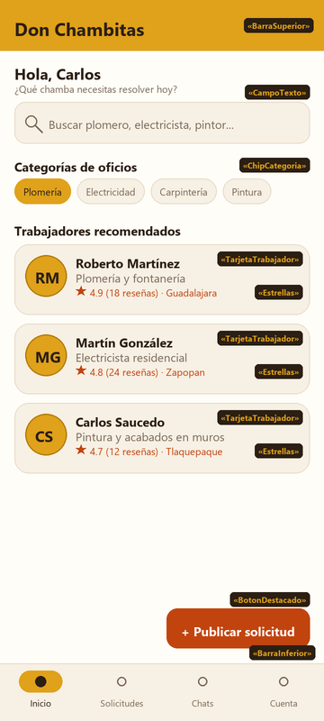

### 5.2 Estado vacío
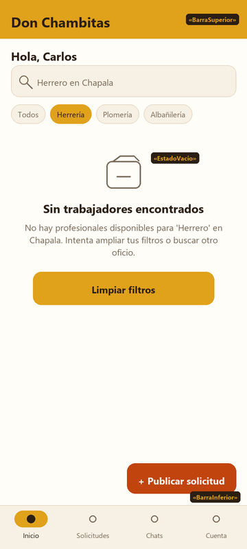

### 5.3 Estado error
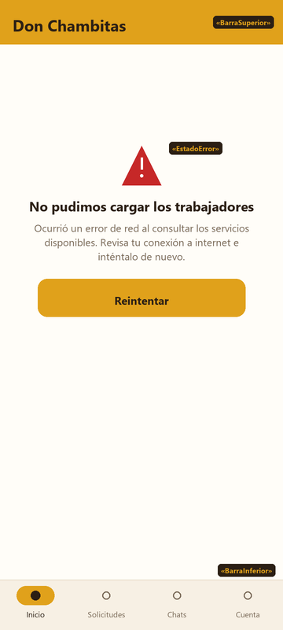

### Objetivo y descripción
Pantalla principal del usuario con rol cliente. Brinda acceso al buscador de oficios, catálogo de categorías y tarjetas de trabajadores destacados. Cuenta con un botón de acción flotante destacado para publicar solicitudes de trabajo y la barra inferior de 4 destinos de navegación.

### Zonas y componentes exactos
- **Encabezado:** `BarraSuperior` en color `Mostaza` con título "Don Chambitas".
- **Búsqueda rápida:** `CampoTexto` estilizado con icono de lupa (`Search`) y texto de sugerencia.
- **Catálogo de categorías:** Fila de deslizamiento horizontal con `ChipCategoria` (Plomería, Electricidad, Carpintería, Pintura, etc.).
- **Lista de recomendaciones:**
  - Tarjetas `TarjetaTrabajador`: iniciales o foto del perfil, nombre completo en `Carbon`, título/oficio en `Cafe`, calificación mediante componente `Estrellas` en `Terracota` con total de reseñas y municipio.
- **Estados condicionales (en `ContenedorEstado`):**
  - `EstadoVacio`: Se presenta cuando no hay coincidencias de trabajadores en la categoría o término buscado. Muestra icono grande en `Cafe`, título explicativo, mensaje de ayuda y `BotonPrincipal` para "Limpiar filtros".
  - `EstadoError`: Se presenta cuando falla la conexión o el servicio de datos. Muestra icono de advertencia en color `Error`, título, mensaje amigable y `BotonPrincipal` para "Reintentar".
- **Acción flotante:** `BotonDestacado` en color `Terracota` con texto e icono en blanco ("+ Publicar solicitud") situado sobre la esquina inferior derecha.
- **Navegación:** `BarraInferior` fija con los 4 destinos del cliente: Inicio (activo, con indicador en `Mostaza`), Solicitudes, Chats y Cuenta.

### Elementos tocables y comportamiento
| Elemento | Componente | Comportamiento al tocar |
|---|---|---|
| Buscador | `CampoTexto` | Al enfocar y escribir o dar enter, navega a `P-06` (Resultados de búsqueda) pasando el término como parámetro. |
| Chip de oficio | `ChipCategoria` | Filtra los trabajadores mostrados en pantalla según el oficio seleccionado o navega a `P-06` con la categoría preseleccionada. |
| Tarjeta de trabajador | `TarjetaTrabajador` | Abre el perfil público detallado del trabajador en `P-07`, pasando su identificador único. |
| Calificación y estrellas | `Estrellas` | Modo lectura en tarjeta; al tocar la tarjeta navega a `P-07` donde se leen las reseñas. |
| "+ Publicar solicitud" | `BotonDestacado` | Abre el formulario de publicación de solicitud en `P-08`. |
| "Limpiar filtros" (en vacío) | `BotonPrincipal` | Restablece el buscador y los chips al estado inicial ("Todos"), recargando los trabajadores recomendados. |
| "Reintentar" (en error) | `BotonPrincipal` | Vuelve a consultar la fuente de datos ejecutando la carga reactiva con spinner en `Cargando`. |
| Pestaña Inicio | `BarraInferior` | Destino actual (hace scroll al inicio). |
| Pestaña Solicitudes | `BarraInferior` | Navega a `P-09` (Mis solicitudes del cliente). |
| Pestaña Chats | `BarraInferior` | Navega a `P-15` (Bandeja de conversaciones). |
| Pestaña Cuenta | `BarraInferior` | Navega a `P-18` (Mi cuenta). |

---

## 6. P-10 · Inicio trabajador (3 estados)

### 6.1 Estado con datos (Contenido)
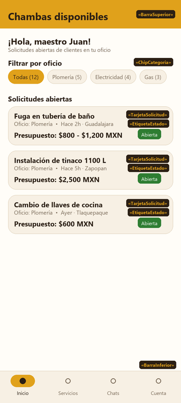

### 6.2 Estado vacío
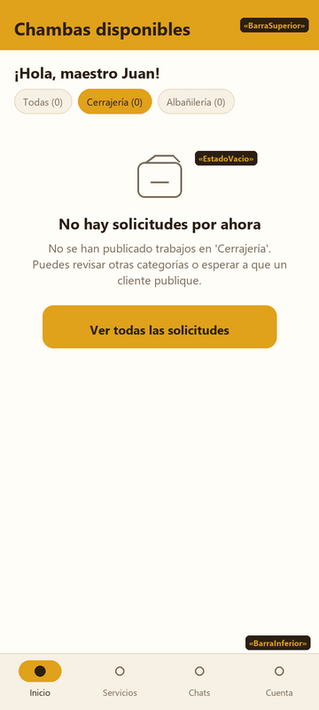

### 6.3 Estado error
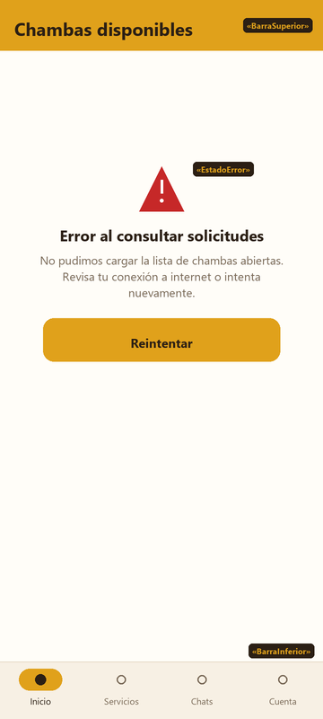

### Objetivo y descripción
Pantalla principal para el usuario con rol de trabajador. Despliega la lista de solicitudes de chamba abiertas publicadas por clientes en su oficio o área geográfica, permitiendo filtrarlas de manera ágil por categoría.

### Zonas y componentes exactos
- **Encabezado:** `BarraSuperior` en `Mostaza` con título "Chambas disponibles".
- **Filtros rápidos:** Fila de `ChipCategoria` mostrando la categoría activa ("Todas", "Plomería", "Electricidad", etc.) y contador de chambas.
- **Lista de chambas:**
  - Tarjetas `TarjetaSolicitud`: Título de la chamba en `Carbon`, oficio y tiempo relativo/municipio en `Cafe`, presupuesto ofrecido en `Carbon`, y etiqueta `EtiquetaEstado` en color `Exito` ("Abierta").
- **Estados condicionales (en `ContenedorEstado`):**
  - `EstadoVacio`: Se presenta cuando no hay solicitudes abiertas en la categoría seleccionada. Muestra icono de portapapeles en `Cafe`, subtítulo explicativo, mensaje orientativo y `BotonPrincipal` para "Ver todas las solicitudes".
  - `EstadoError`: Se presenta ante fallas de red o indisponibilidad del servicio. Muestra icono de advertencia en color `Error`, mensaje de acción y `BotonPrincipal` para "Reintentar".
- **Navegación:** `BarraInferior` fija con los 4 destinos del trabajador: Inicio (activo, indicador `Mostaza`), Servicios, Chats y Cuenta.

### Elementos tocables y comportamiento
| Elemento | Componente | Comportamiento al tocar |
|---|---|---|
| Chip de categoría | `ChipCategoria` | Filtra reactivamente la lista de solicitudes abiertas por el oficio correspondiente. Si no hay registros, activa el `EstadoVacio`. |
| Tarjeta de solicitud | `TarjetaSolicitud` | Navega a `P-19` (Detalle de la solicitud), donde el trabajador puede leer los requerimientos completos y enviar su postulación. |
| "Ver todas las solicitudes" | `BotonPrincipal` | Selecciona el chip "Todas", recargando la lista completa de solicitudes abiertas. |
| "Reintentar" (en error) | `BotonPrincipal` | Dispara una nueva petición a la capa de datos mostrando brevemente `Cargando`. |
| Pestaña Inicio | `BarraInferior` | Destino actual del trabajador. |
| Pestaña Servicios | `BarraInferior` | Navega a `P-12` (Mis servicios publicados). |
| Pestaña Chats | `BarraInferior` | Navega a `P-15` (Bandeja de conversaciones). |
| Pestaña Cuenta | `BarraInferior` | Navega a `P-18` (Mi cuenta). |

---

## 7. P-18 · Mi cuenta

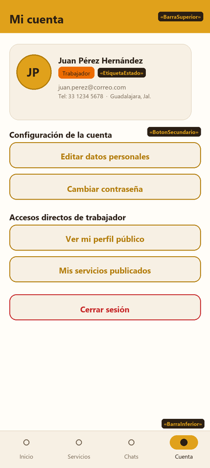

### Objetivo y descripción
Pantalla compartida para la administración del perfil, seguridad de la cuenta y opciones de sesión. Se adapta visualmente mostrando el rol del usuario ("Cliente" o "Trabajador") y habilitando accesos directos específicos (como ver perfil público o servicios si es trabajador).

### Zonas y componentes exactos
- **Encabezado:** `BarraSuperior` en color `Mostaza` con título "Mi cuenta".
- **Tarjeta de cabecera de perfil:**
  - Superficie `Arena` con borde `Borde`.
  - Avatar circular con iniciales o foto de perfil (80 dp).
  - Nombre completo del usuario (`cuerpoFuerte` en `Carbon`).
  - Rol de usuario modelado con `EtiquetaEstado` (en color `Advertencia` para Trabajador o `Mostaza` para Cliente).
  - Correo electrónico, teléfono y municipio en tipografía `secundario` / `pie` en `Cafe`.
- **Bloque de configuración general:**
  - `BotonSecundario`: "Editar datos personales" (contorno `MostazaOscuro`).
  - `BotonSecundario`: "Cambiar contraseña" (contorno `MostazaOscuro`).
- **Bloque de accesos directos (si es trabajador):**
  - `BotonSecundario`: "Ver mi perfil público" (navega a `P-07`).
  - `BotonSecundario`: "Mis servicios publicados" (navega a `P-12`).
- **Zona de sesión:**
  - `BotonSecundario` estilizado para "Cerrar sesión" en color `Error` (`#C62828`).
- **Navegación:** `BarraInferior` fija con la pestaña Cuenta activa (indicador en `Mostaza`).

### Elementos tocables y comportamiento
| Elemento | Componente | Comportamiento al tocar |
|---|---|---|
| Avatar / Foto de perfil | Avatar circular | Abre selector de imagen en dispositivo para actualizar foto de perfil. |
| "Editar datos personales" | `BotonSecundario` | Abre modal o pantalla de edición de nombre, teléfono y ubicación. |
| "Cambiar contraseña" | `BotonSecundario` | Despliega flujo para ingresar contraseña actual y nueva contraseña. |
| "Ver mi perfil público" | `BotonSecundario` | Navega a `P-07` mostrando la vista previa pública del trabajador. |
| "Mis servicios publicados" | `BotonSecundario` | Navega a `P-12` (Lista de servicios con opciones de editar, pausar y eliminar). |
| "Cerrar sesión" | `BotonSecundario` | Despliega diálogo de confirmación ("¿Deseas cerrar tu sesión?"). Al confirmar, invoca `cerrarSesion()` en el repositorio, limpia las credenciales guardadas y redirige a `P-02` (Iniciar sesión) limpiando la pila de navegación. |
| Pestaña Inicio | `BarraInferior` | Navega a `P-05` (Cliente) o `P-10` (Trabajador). |
| Pestaña Solicitudes / Servicios | `BarraInferior` | Navega a `P-09` (Cliente) o `P-12` (Trabajador). |
| Pestaña Chats | `BarraInferior` | Navega a `P-15` (Bandeja de conversaciones). |
| Pestaña Cuenta | `BarraInferior` | Destino actual. |

---

## Verificación de consistencia y componentes

Cruzando todos los wireframes contra [`DISENO.md`](../tecnico/DISENO.md):

1. **Componentes base empleados:**
   - `BarraSuperior` (utilizado en P-02, P-03, P-04, P-05, P-10, P-18)
   - `BarraInferior` (utilizado en P-05, P-10, P-18)
   - `BotonPrincipal` (utilizado en P-02, P-03, P-04, P-05 vacío/error, P-10 vacío/error)
   - `BotonSecundario` (utilizado en P-18)
   - `BotonDestacado` (utilizado en P-05 para el botón flotante "+ Publicar solicitud")
   - `BotonTexto` (utilizado en P-02, P-03, P-04)
   - `CampoTexto` (utilizado en P-02, P-03, P-04, P-05)
   - `CampoContrasena` (utilizado en P-02, P-03)
   - `TarjetaTrabajador` (utilizado en P-05)
   - `TarjetaSolicitud` (utilizado en P-10)
   - `ChipCategoria` (utilizado en P-03, P-05, P-10)
   - `Estrellas` (utilizado en P-05 dentro de `TarjetaTrabajador`)
   - `EtiquetaEstado` (utilizado en P-10 y P-18)
   - `Cargando` (utilizado en P-01)
   - `EstadoVacio` (utilizado en P-05 vacío y P-10 vacío)
   - `EstadoError` (utilizado en P-05 error y P-10 error)
   - **Ningún componente fuera de catálogo:** Cero componentes inventados o no registrados en `DISENO.md`.

2. **Paleta Taller:**
   - Mostaza (`#E0A11B`), Mostaza Oscuro (`#B37D08`), Terracota (`#C1440E`), Carbon (`#2B1F14`), Cafe (`#7A6A58`), Crema (`#FFFDF8`), Arena (`#F7F0E4`), Borde (`#E6DAC6`).
   - Semánticos: Éxito (`#2E7D32`), Advertencia (`#ED6C02`), Error (`#C62828`), Blanco (`#FFFFFF`).
   - Todos los contrastes cumplen WCAG 2.1 (Carbon sobre Mostaza 7.09:1 AAA, Blanco sobre Terracota 5.12:1 AA, Carbon sobre Crema/Arena >14:1 AAA).
